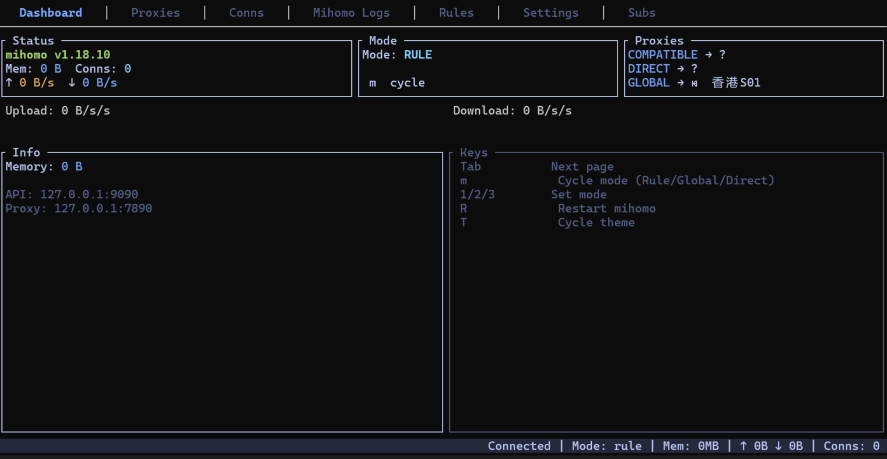

# clash-tui

A cross-platform terminal UI for Clash/Mihomo proxy management, written in Rust.


## Features

- **7 TUI Tabs** — Dashboard, Proxies, Connections, Mihomo Logs, Rules, Settings, Subscriptions
- **Embedded Mihomo Core** — v1.18.10 embedded at compile time, auto-starts in background
- **Non-blocking Startup** — TUI appears instantly, mihomo boots in background with real-time status
- **Subscription Management** — add/remove/subscribe with full TUI input (paste-safe, cursor navigation)
- **System Proxy** — one-key toggle Windows system proxy (Registry + WinINET notification)
- **Latency Testing** — concurrent per-proxy testing, color-coded results, sort by delay
- **3 Runtime Modes** — standalone (default), daemon (`--daemon`), client (`--port <N>`)
- **Themes** — Tokyo Night / Catppuccin / Gruvbox, `T` to cycle, saved to config
- **Vim Keybindings** — `j/k/↑↓` navigation, `Tab` page switch, `Esc` back

## Screenshot



## Quick Start

### Windows

Download `clash-tui_*_windows_amd64.zip` from [Releases](https://github.com/1879615351/clash-tui/releases), extract and run:

```powershell
Expand-Archive clash-tui_*_windows_amd64.zip -DestinationPath clash-tui
.\clash-tui\clash-tui.exe
```

### Ubuntu 20.04+

Download and install the `.deb` package:

```bash
curl -LO https://github.com/1879615351/clash-tui/releases/latest/download/clash-tui_0.1.0_amd64.deb
sudo dpkg -i clash-tui_0.1.0_amd64.deb
clash-tui
```

Or use the portable `.tar.gz`:

```bash
curl -LO https://github.com/1879615351/clash-tui/releases/latest/download/clash-tui_0.1.0_linux_amd64.tar.gz
tar xzf clash-tui_0.1.0_linux_amd64.tar.gz
./clash-tui_0.1.0_linux_amd64/clash-tui
```

### Usage

The embedded mihomo core starts automatically. Add a subscription URL in the **Subs** page (`a` to add, paste URL, `Enter` to confirm), then press `u` to download. Proxies appear in the **Proxies** page.

## Key Bindings

### Global
| Key | Action |
|-----|--------|
| `Tab` / `Shift+Tab` | Next / Previous page |
| `q` / `Ctrl+C` | Quit |
| `?` | Help overlay |
| `r` | Force refresh |
| `T` | Cycle theme |

### Dashboard
| Key | Action |
|-----|--------|
| `m` | Cycle Clash mode (Rule→Global→Direct) |
| `1` / `2` / `3` | Set mode directly |
| `R` | Restart mihomo |

### Proxies
| Key | Action |
|-----|--------|
| `j/k` / `↑↓` | Navigate groups / proxies |
| `Enter` / `→` | Enter proxy list / Switch proxy |
| `Esc` / `←` | Back to group list |
| `t` | Test latency (single proxy in list, all in group) |
| `s` | Toggle sort by latency |

### Connections
| Key | Action |
|-----|--------|
| `j/k` / `↑↓` | Navigate connections |
| `d` | Close selected connection |
| `D` | Close all connections |

### Mihomo Logs
| Key | Action |
|-----|--------|
| `j/k` / `↑↓` | Scroll |
| `e` / `w` / `i` | Filter: Error / Warning / Info |
| `a` | Show all |
| `Home` / `End` | Jump top / bottom |
| `↑/k` disables auto-scroll, `End` re-enables |

### Settings
| Key | Action |
|-----|--------|
| `p` | Toggle system proxy |
| `P` | Enable system proxy |
| `o` | Disable system proxy |
| `T` | Cycle theme |

### Subscriptions
| Key | Action |
|-----|--------|
| `j/k` / `↑↓` | Navigate |
| `u` | Update / Download subscription |
| `e` | Toggle enable/disable |
| `a` | Add subscription (modal input) |
| `x` / `Delete` | Remove subscription |
| `Enter` | Confirm input |
| `Esc` | Cancel input |

## CLI Options

```
Usage: clash-tui.exe [OPTIONS]

Options:
  --daemon          Run as background daemon
  --install-core    Extract embedded mihomo to disk
  --port <PORT>     Connect to daemon (client mode)
  --host <HOST>     API host [default: 127.0.0.1]
  --api-port <PORT> API port [default: 9090]
```

## Build from Source

```bash
# Prerequisites: Rust nightly
git clone https://github.com/1879615351/clash-tui.git
cd clash-tui
cargo build --release
.\target\release\clash-tui.exe
```

The build script downloads mihomo v1.18.10 (~28MB) via `build.rs` and embeds it with `include_bytes!`. Final binary is ~35MB, fully self-contained.

### Linux

```bash
sudo apt install pkg-config libssl-dev build-essential
cargo build --release
./target/release/clash-tui
```

## Architecture

```
┌──────────────────────────────────────────┐
│            clash-tui.exe                  │
│  ┌──────────────────────────────────┐    │
│  │     TUI (ratatui + crossterm)    │    │
│  │  7 tabs, vim keybindings         │    │
│  ├──────────────────────────────────┤    │
│  │     App Core                     │    │
│  │  event loop, state, dispatch     │    │
│  ├──────────────────────────────────┤    │
│  │  ClashApi trait                  │    │
│  │  ├─ ClashClient   (direct HTTP)  │    │
│  │  └─ IpcClashClient (IPC daemon)  │── HTTP ──► mihomo :9090
│  ├──────────────────────────────────┤    │
│  │  Refresh loop (1s interval)      │    │
│  │  → refresh_all → data_tx → UI    │    │
│  └──────────────────────────────────┘    │
│                                           │
│  mihomo v1.18.10 (embedded, 28MB)        │
│  background start → signal → UI updates   │
└──────────────────────────────────────────┘
```

## Config

`%APPDATA%/clash-tui/config.toml` (Windows) or `~/.config/clash-tui/config.toml` (Linux):

```toml
[api]
host = "127.0.0.1"
port = 9090
# secret = "your-api-secret"  # optional, for authenticated mihomo API

[ui]
theme = "tokyo-night"       # tokyo-night | catppuccin | gruvbox
refresh_interval_ms = 1000

[core]
core_type = "mihomo"
core_path = ""              # empty = use embedded binary

[subscription]
auto_update = false
interval_hours = 24
```

### File locations

| File | Path |
|------|------|
| Config | `%APPDATA%/clash-tui/config.toml` |
| Subscriptions | `%APPDATA%/clash-tui/subscriptions.toml` |
| Mihomo core | `%APPDATA%/clash-tui/core/mihomo.exe` |
| Mihomo config | `%APPDATA%/clash-tui/core/config.yaml` |
| Mihomo log | `%APPDATA%/clash-tui/core/mihomo.log` |
| App log | `%APPDATA%/clash-tui/clash-tui.log` |

## Tech Stack

- **UI**: ratatui 0.29 + crossterm 0.28
- **Async**: tokio
- **HTTP**: reqwest 0.12
- **Serialization**: serde + serde_json + serde_yaml + toml
- **CLI**: clap 4
- **Embedded core**: build.rs → GitHub Releases download → `include_bytes!`
- **Platform (Win)**: winreg (system proxy), flate2 + zip (core extraction)

## Troubleshooting

If the UI shows "Starting..." indefinitely:

1. Check if mihomo is running: `tasklist | findstr mihomo`
2. Check mihomo's own log: `%APPDATA%/clash-tui/core/mihomo.log` — mihomo may have crashed on startup (e.g. missing subscription files, invalid config)
3. Check the TUI app log: `%APPDATA%/clash-tui/clash-tui.log` — look for `Mihomo API ready` (success) or `Failed to install core` / `Failed to spawn mihomo` (errors)

The TUI regenerates `config.yaml` from available subscription files on every startup. If subscription files (`sub_*.yaml`) were deleted but `config.yaml` still references them, mihomo will crash. Delete `config.yaml` to force a fresh minimal config, or re-download subscriptions with `u` in the Subs page.

## License

MIT
